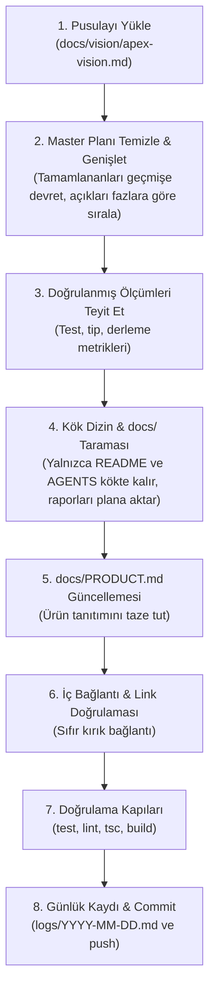

# Apex — Dokümantasyon Dizini ve Mimari Rehberi

> **Projenin Temel Pusulası ve Vizyonu:** [`docs/vision/apex-vision.md`](vision/apex-vision.md)  
> Apex, Formula 1 ve motor sporları kültürünü yalnızca anlık yarış sonuçlarından ibaret olmaktan çıkarıp; köklü tarihini, teknik dinamiklerini, ikonik araçlarını ve insan hikayelerini bir araya getiren; arka planda bir saat mekanizması gibi harmonik işleyen veri mimarisiyle son kullanıcıya kusursuz, hızlı, akıcı ve görsel olarak özgün bir dijital arşiv-ekosistem sunar.

---

## 1. Otorite ve Kural Hiyerarşisi

Tüm yapay zeka ajanları (Claude Code, Cursor, Antigravity vb.) ve geliştiriciler aşağıdaki hiyerarşiye kesinlikle uyar:

1. **Kod ve Testler:** Gerçek kod tabanı ve yeşil geçen testler birinci otoritedir.
2. **Agent Anayasası ([`AGENTS.md`](../AGENTS.md)):** Proje genelindeki kurallar ve yasaklar (hardcode yasakları, veri bütünlüğü, gizlilik).
3. **Master Plan ([`docs/plans/master-plan.md`](plans/master-plan.md)):** Geliştirici vizyonu ve direktiflerinin işlendiği, açık işlerin faz faz yönetildiği tek canlı liste.
4. **Referans Dokümanı ([`docs/reference/apex-reference.md`](reference/apex-reference.md)):** Ölçülmüş, doğrulanmış durum ve sistem envanteri.
5. **Tasarım Sistemi ([`docs/design/apex-design.md`](design/apex-design.md)):** Apple tasarım ilkeleri ve F1 kimliğini sentezleyen master tasarım otoritesi (SSOT).
6. **Vizyon ve Misyon ([`docs/vision/apex-vision.md`](vision/apex-vision.md)):** Projenin temel felsefesi ve hedef mimarisi.

---

## 2. Dokümantasyon Haritası

```
docs/
├── README.md                           # Bu dosya — Dokümantasyon ana indeksi ve haritası
├── PRODUCT.md                          # Proje ve ürün tanıtım vitrini (Her refactoring/freshness sonrası güncellenir)
├── DENETIM.md                          # Misyon ve Eksiklikler Denetim Raporu (Brownfield analizi)
├── procedures.md                       # 8 adet tekrarlanabilir operasyonel ve bakım prosedürü
├── F1_Anlati_Stil_Kilavuzu.md          # Antoloji ve içerik için temel editoryal "ev sesi" rehberi
├── F1_Anlati_Stil_Kilavuzu_v2.md       # Akustik analiz, sayfa prozodisi ve çoklu format editoryal matrisi
│
├── vision/                             # Vizyon, Misyon ve Teknik Temeller
│   ├── apex-vision.md                  # Master vizyon, misyon, temel sütunlar ve mimari pusula (SSOT)
│   ├── technical.md                    # Agent teknik sistem ve veri akışı özeti
│   └── skills.md                       # Ekosistem skill tetikleyici haritası
│
├── plans/                              # Eylem ve Geliştirme Planları
│   └── master-plan.md                  # Tek canlı açık iş listesi ve geliştirici direktifleri (Faz faz sıralı)
│
├── design/                             # Tasarım Sistemi ve Arayüz Standartları
│   ├── apex-design.md                  # Master Tasarım Sistemi Mimarisi (Apple HIG + F1 Ruhu)
│   ├── apex-design-language.md         # Tipografi, renk, yüzey derinliği ve layout kuralları
│   ├── tokens.json                     # Resmi tasarım değişkenleri (renkler, fontlar, aralıklar)
│   ├── README.md                       # Tasarım kütüphanesi rehberi
│   ├── skills/                         # Onaylı 5 katmanlı tasarım skill orkestrasyonu
│   └── [arka plan denemeleri]          # premium-design-philosophy, universal-principles vb.
│
└── reference/                          # Sistem Referansları ve Mühendislik Hafızası
    ├── apex-reference.md               # Master yaşayan referans (ölçülmüş gerçekler, test sonuçları)
    ├── mimari.md                       # Backend mimarisi, saat mekanizması veri akışı, Supabase & cron
    ├── muhendislik-dersleri.md         # Yaşanmış tuzaklar, Next.js/DB mimari dersleri ve çözümler
    ├── stories-assets-ledger.md        # public/stories 56 görsel varlık dökümü ve lisans envanteri
    ├── anthology-image-map.md          # 17 antoloji hikayesinin görsel kullanım eşlemesi
    └── glossary-icon-prompts.md        # Tech Glossary teknik CAD / blueprint ikon üretim promptları
```

---

## 3. Bölüm Detayları ve Sorumluluklar

### 🧭 `docs/vision/` (Vizyon ve Misyon)
- **[`apex-vision.md`](vision/apex-vision.md):** Projenin "Neden?" sorusuna yanıt veren ana metin. Saat mekanizması harmonik veri akışı, sıfır takılmalı akıcı frontend ve rafine UI/UX dengesini kurar.
- **[`technical.md`](vision/technical.md):** Mimari bileşenlerin hızlı teknik dökümü.

### 🌟 `docs/PRODUCT.md` (Ürün ve Proje Tanıtım Dokümanı)
- Projenin resmi vitrin ve ürün özet dökümanıdır.
- Her `docs refinement` veya `docs freshness sweep` prosedürü sonrasında mimari, arayüz ve vizyonel kararları yansıtacak şekilde güncel tutulması zorunludur.

### 📋 `docs/plans/` (İş Listeleri ve Planlama)
- **[`master-plan.md`](plans/master-plan.md):** Geliştirici direktiflerini ve vizyonunu içeren, tamamlanan maddelerin geçmişe devredildiği, yalnızca açık işlerin önem sırasına göre 7 faz halinde listelendiği tek canlı plan.

### 🎨 `docs/design/` (Tasarım Sistemi)
- **[`apex-design.md`](design/apex-design.md):** F1 dinamizmini Apple tasarım ilkeleri (titiz mikro-etkileşimler, fizik temelli yay hareketleri, saydam malzemeler, hiyerarşik tipografi) ile birleştiren master rehber.
- **[`tokens.json`](design/tokens.json):** Kod tabanındaki Tailwind ve CSS tokenlarının referans kaynağı.

### ⚙️ `docs/reference/` (Mühendislik ve Veri Referansı)
- **[`apex-reference.md`](reference/apex-reference.md):** Ölçülmüş durumlar, canlı hostlar, bağımlılıklar, güvenlik açıkları ve dokümantasyon envanteri.
- **[`mimari.md`](reference/mimari.md):** Çok kaynaklı (F1DB, Jolpica, OpenF1, RSS) veri hattı, Vercel cron'ları, 3 kademeli okuma fallback'i ve Supabase PostgreSQL modeli.
- **[`muhendislik-dersleri.md`](reference/muhendislik-dersleri.md):** Geliştirme süresince karşılaşılan 31 somut tuzak (Next.js ISR kilitleri, DB round=NULL unique index sorunları, asset resolution hataları) ve kanıtlanmış çözümleri.

---

## 4. Dokümantasyon Kuralları & Docs Refinement (Prosedür 8)

### 🛑 Kök Dizin Doküman Kısıtı:
Ana proje kök dizininde (`/`) kesinlikle serbest dokümantasyon, rapor veya markdown dosyası **bulunamaz**.
Kök dizinde yalnızca:
- [`README.md`](../README.md)
- [`AGENTS.md`](../AGENTS.md)
yer alabilir. Tüm plan, spek, rapor, tasarım ve referans belgeleri `docs/` altında konumlandırılmalıdır.

### ♻️ Rapor ve Referans Yaşam Döngüsü:
Bir denetim veya araştırma raporu (ör. `DENETIM.md` vb.) tamamen incelenip açık eylem maddeleri plan dokümanına (`docs/plans/master-plan.md`) aktarıldıktan sonra repodan silinmelidir. Boşa eski döküman saklanmaz; arşiv git geçmişidir.

### 🔄 Docs Refinement Prosedürü Döngüsü:


